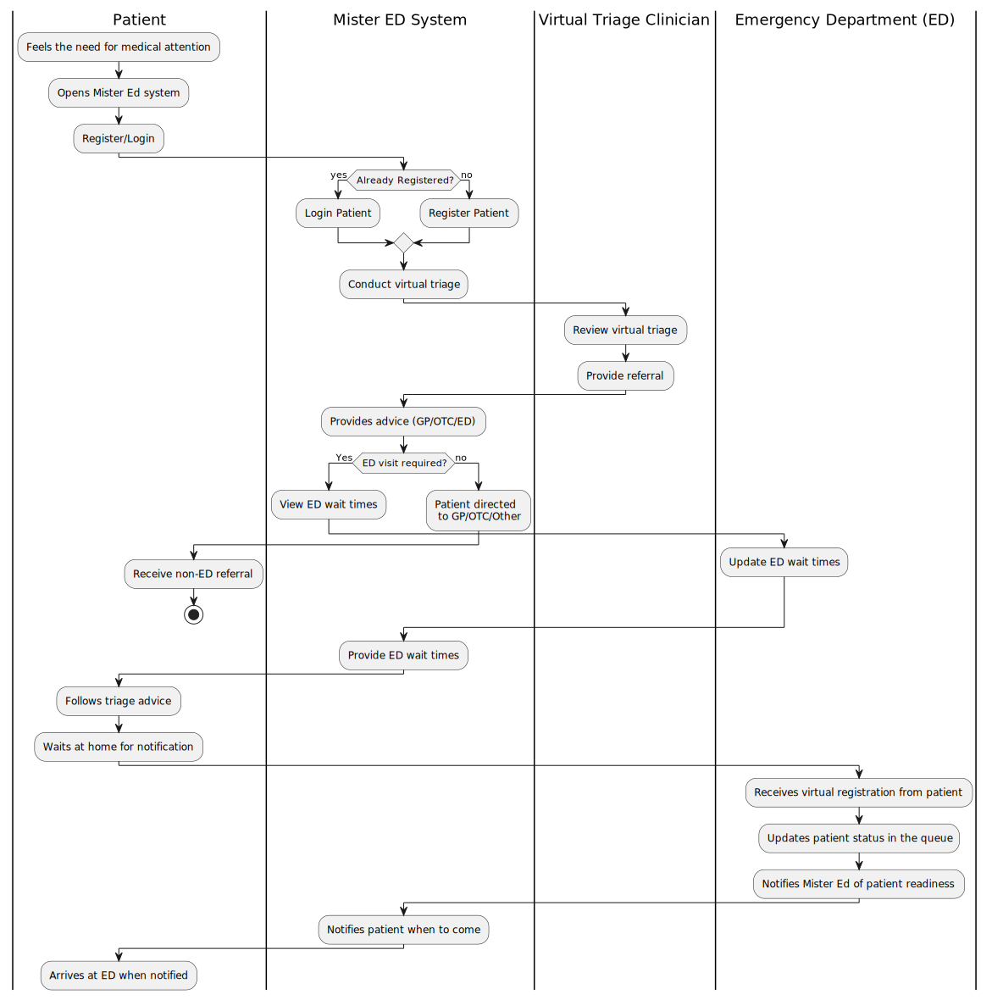
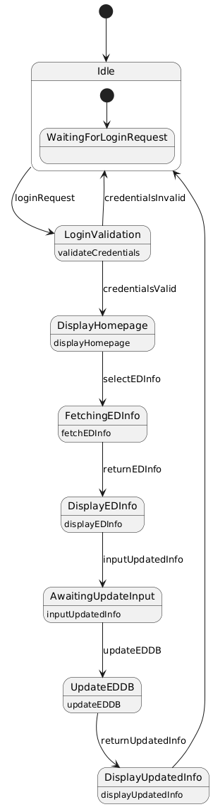
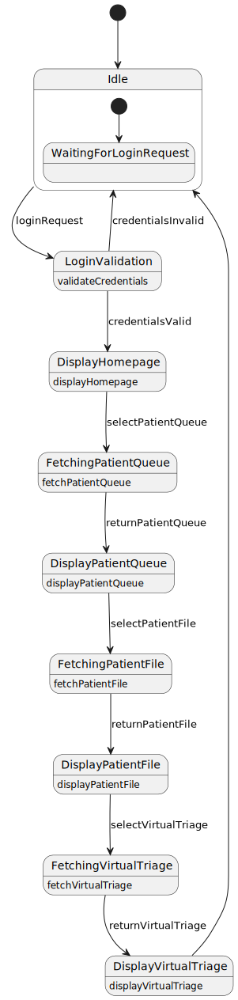

## Milestone 2

# 1. Sprint Plan

This section details our plan for the code portion only of our project:

Milestone 2: Start initial code, make homepage, and start on Wait Times Page  
Milestone 3: Create database, server file, and API connections for Wait Times Process  
Milestone 4: Populate other pages with content (minimal functionality)  

We were able to complete all functionality listed in Milestone 2 and didn't need to push anything to Milestone 3 or 4.

# 2. Class Model

  
    This model details the fundamental entities of the entire Mister ED system, with all of the relationships and multiplicities included. There is a Patient, VirtualTriageClinician, EDAdmin, GP, ED, Clinic, and VirtualTriage Class with their associated attributes and methods required. 

# 3. Collaboration Models

  #1: ED Admin  
    
   
   This model focuses on the interactions between the ED Admin and the Mister ED system. The task for the ED Admin is updating ED Info. They go through the Login Page, Home Page, ED HomePage, and finally the corresponding ED Page it wants to update.
     
  #2: GP
   
  
   This model focuses on the interactions between the GP and the Mister ED system. The task for the GP is viewing a Patients Virtual Triage. They go through the Login Page, Home Page, Clinic Queue, and then the Patient Account to view the Virtual Triage. 
     
  #3: Patient
   
   
    This model focuses on the interactions between the Patient and the Mister ED system. The task for the Patient is registering in an ED line and filling out their Virtual Triage Form. They go through the Login Page, Home Page, ED Page, and then fill out the Virtual Triage Form. 
     
  #4: Clinician
    
   
    This model focuses on the interactions between the Clinician and the Mister ED system. The task for the Clinician is referring a patient. They go through the Login Page, Home Page, ED Page, Patient Account, and then finally they can refer the patient.
   

# 4. Sequence Models

  #1: 
    
  
   

  #2:
   
   
   This sequence diagram describes the interactions of the GP wanting to view the Virtual Triage of a patient in the clinic queue.

  #3:
   
  
   
  
  #4:
   
  
   

  #5:
   
  
    This sequence diagrams describes the process of a patient choosing to go through the triage process and register in the waiting queue. (click to view or view in light mode)  

# 5. Activity Model

# 6. State Models

  #1: 
    
  
   

  #2:
   
   
  This state machine diagram describes the appropriate events of the machine when the GP wants to view the Virtual Triage of a patient in the clinic queue.

  #3:
   
  
    This state machine shows the transition of state when a patient goes through the triage process with an ED
  
  #4:
   
  
   
  
  #5:
   
  
   

# 7. Data Flow Models

# 8. Entity Relationship Model

# 9. Component Model

# 10. Deployment Model

# 11. Contributions

| Name | Contributions | 
| ----------- | ---------------------- |
| Ella |  |
| Andra |  |
| Shyla | Class Model, Collaboration Models, State Model for GP, Sequence Model for GP, and Sprint Plan Editing|
| Val | | 
| Alex |  |

