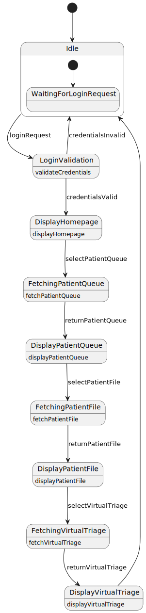

## Milestone 2

# 1. Sprint Plan

Week 2: Discuss created diagrams, start initial code, make homepage, and start on Wait Times Page  
Week 3: Finalize diagrams, create database, server file, and API connections for Wait Times Process  
Week 4: Populate other pages with content (minimal functionality)  

# 2. Class Model

    
  
   

# 3. Collaboration Model

# 4. Sequence Models

  #1: 
    
  
   

  #2:
   
   
   This sequence diagram describes the interactions of the GP wanting to view the Virtual Triage of a patient in the clinic queue.

  #3:
   
  
   
  
  #4:
   
  
   

  #5:
   
  
    This sequence diagrams describes the process of a patient choosing to go through the triage process and register in the waiting queue. (click to view or view in light mode)  
  
  #6:
   
  
   

# 5. Activity Model

# 6. State Models

  #1: 
    
  
   

  #2:
   
   
  This state machine diagram describes the appropriate events of the machine when the GP wants to view the Virtual Triage of a patient in the clinic queue.

  #3:
   
  
   
  
  #4:
   
  
   
  
  #5:
   
  
   

