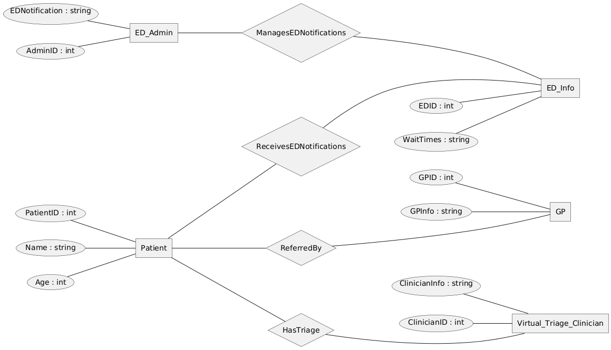
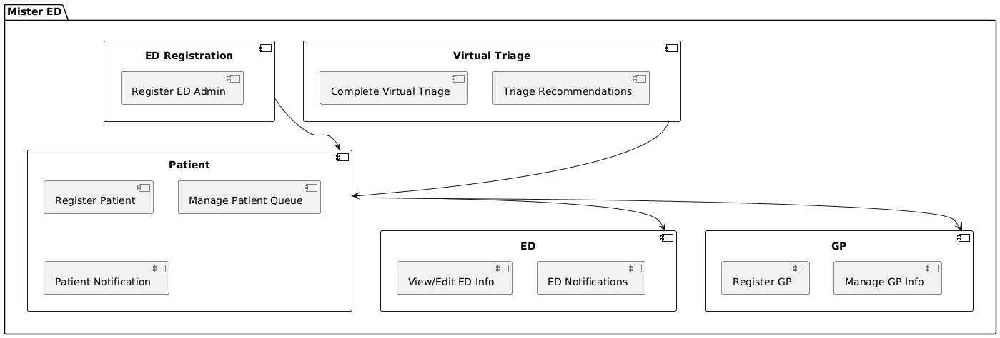
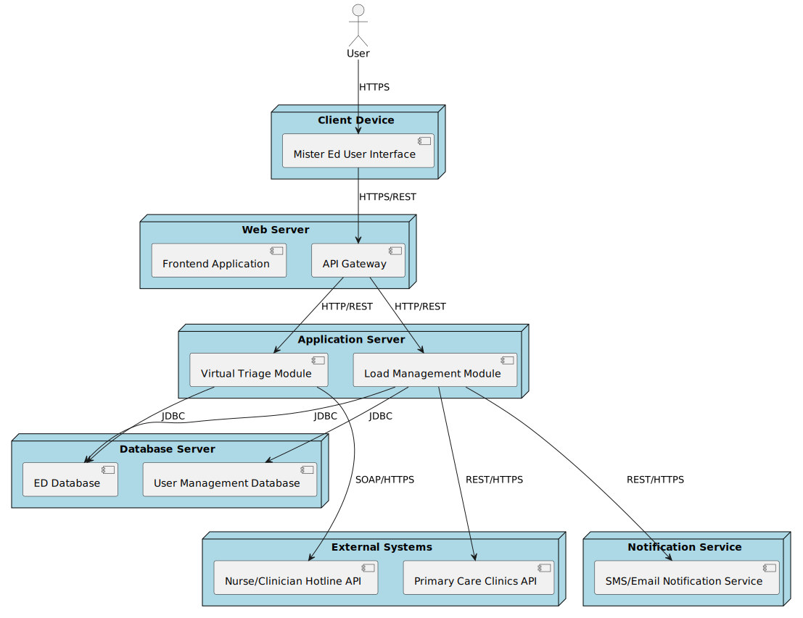

## Milestone 2

# 1. Sprint Plan

This section details our plan for the code portion only of our project:

Milestone 2: Start initial code, make homepage, and start on Wait Times Page  
Milestone 3: Create database, server file, and API connections for Wait Times Process  
Milestone 4: Populate other pages with content (minimal functionality)  

We were able to complete all functionality listed in Milestone 2 and didn't need to push anything to Milestone 3 or 4.

# 2. Class Model

  
    This model details the fundamental entities of the entire Mister ED system, with all of the relationships and multiplicities included with the 1 or M marker. There is a Patient, VirtualTriageClinician, EDAdmin, GP, ED, Clinic, and VirtualTriage Class with their associated attributes and methods required. 

# 3. Collaboration Models

  #1: ED Admin  
    
   
   This model focuses on the interactions between the ED Admin and the Mister ED system. The task for the ED Admin is updating ED Info. They go through the Login Page, Home Page, ED HomePage, and finally the corresponding ED Page it wants to update.
     
  #2: GP
   
  
   This model focuses on the interactions between the GP and the Mister ED system. The task for the GP is viewing a Patients Virtual Triage. They go through the Login Page, Home Page, Clinic Queue, and then the Patient Account to view the Virtual Triage. 
     
  #3: Patient
   
   
    This model focuses on the interactions between the Patient and the Mister ED system. The task for the Patient is registering in an ED line and filling out their Virtual Triage Form. They go through the Login Page, Home Page, ED Page, and then fill out the Virtual Triage Form. 
     
  #4: Clinician
    
   
    This model focuses on the interactions between the Clinician and the Mister ED system. The task for the Clinician is referring a patient. They go through the Login Page, Home Page, ED Page, Patient Account, and then finally they can refer the patient.
   

# 4. Sequence Models

  #1: 
    
  
   This sequence diagram outlines how the ED admin interacts with the system to ensure the information regarding their ED is accurate and up to date.

  #2:
   
   
   This sequence diagram describes the interactions of the GP wanting to view the Virtual Triage of a patient in the clinic queue.

  #3:
   
  
   
  
  #4:
   
  
    This sequence diagram displays the interactions between the patientm, system, and ED database when a patient logs in and views ED information. 

  #5:
   
  
    This sequence diagram describes the process of a patient choosing to go through the triage process and register in the waiting queue. (click to view or view in light mode)  

# 5. Activity Model

# 6. State Models

  #1: 
    
  
    This state machine illustrates the process followed and states visited for an ED admin to update information about their ED.

  #2:
   
   
  This state machine diagram describes the appropriate events of the machine when the GP wants to view the Virtual Triage of a patient in the clinic queue.

  #3:
   
  
    This state machine shows the transition of state when a patient goes through the triage process with an ED
  
  #4:
   
  
    This state machine shows the state transitions of the system when a patient logs into the system and views ED information. 
  
  #5:
   
  
   

# 7. Data Flow Models
Level 0 DFD:  

  This DFD shows the flow of information through the main processes of the MisterED system. These main processes include registering an account, registering an ED, completing a virtual triage, viewing/editing ED info, and managing patients. Entities such as the Patient, Virtual Triage Clinician, GP, and ED Admin interact with these processes through the exchange of information. 
Level 1 DFD:  

  This DFD further breaks down the higher level processes identified in the level 0 DFD and identifies the main data stores of the system. These include the Users, EDs, Clinics, and Virtual Triage data stores. 

# 8. Entity Relationship Model
 
   This entity relationship diagram displays the systems entities in boxes with their corresponding attributes in bubbles. The diagram also displays how these entities relate to one another and interact via arrows.

# 9. Component Model
 
   The component model shows the main parts of the system depicted in boxes with the connections between entities shown with arrows. 

# 10. Deployment Model
 
  The deployment diagram shows how the system is deployed in a real world system using real physical devices, servers, etc. The nodes are shon in the blue boxes and the connections between the nodes are the solid lines/arrows.
# 11. Contributions

| Name | Contributions | 
| ----------- | ---------------------- |
| Ella | Data Flow Diagrams, Patient state machine, Patient sequence diagram, associated descriptions |
| Andra | ED sequence diagram, ED state machine, Component diagram, ERD |
| Shyla | Class Model, Collaboration Models, State Model for GP, Sequence Model for GP, and Sprint Plan Editing|
| Val | | 
| Alex |  |

