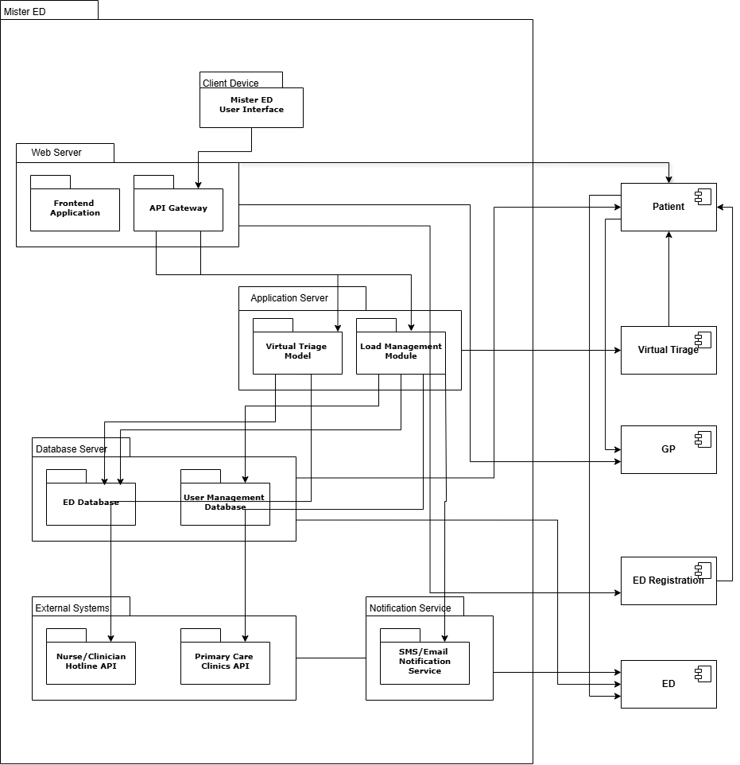

# MisterED Software Architecture Document (SAD)
Content Owners: Ella Palter, Shyla Burns, Andra Rice, Val Savchenko, Alex Moody

## Sections
1. Documentation Roadmap and Overview
2. Architecture Background
3. Views  
  3.1 Module Views  
  3.2 C&C Views  
  3.3 Allocation Views 
4. Mapping Between Views
5. Referenced Materials
6. Glossary and Acronyms

## 1. Documentation Roadmap and Overview
Sub-parts of this section provide information that will help readers or users of the Software Architecture Document (SAD) quickly find information that will enable them to do their jobs. Readers of the SAD seeking an overview should begin here, as should readers interested in finding particular information to answer a specific question.

How the SAD is organized explains the information that is found in each section of the SAD.
How a view is documented explains how architectural views are documented in this SAD.
### Purpose and Scope of the SAD

### How the SAD is Organized
This SAD is organized into the following seven sections:

- This Documentation Roadmap and Overview provides information about this document and its intended audience. It provides the roadmap and document overview. Every reader who wishes to find information relevant to the software architecture described in this document should begin by reading this section, which describes how the document is organized, and where information may be found.
- Architecture Background provides information about the software architecture. It describes the background and rationale for the software architecture. It explains the constraints and influences that led to the current architecture, and it describes the major architectural approaches that have been utilized in the architecture.
- Views and Mapping Between Views specify the software architecture.
- Referenced Materials and Glossary and Acronyms provide reference information. Referenced Materials provides look-up information for documents that are cited elsewhere in this SAD. Glossary and Acronyms is an index of architectural elements and relations giving their definition, and where each is used in this SAD.
### How a View is Documented 
1. Primary Presentation
- Is usually graphical
- Should include a key that explains the notation
- Shows elements and relations among them
- Shows the information you want to convey about the view first
- Should identify elements that are external to scope of the view
- If external entities are not clearly marked in the diagram, consider adding a context diagram
2. Element Catalog
- Explains elements depicted in primary presentation and their properties
- Is usually a table with element name and textual description
- May contain interface documentation
- May contain behavior documentation
3. Variability Guide
- Points where system can be parameterized or reconfigured. Examples:
- Number of instances in a pool
- Support for plug-ins or add-ons
- Support for different versions of OS, database server or runtime environment
- Maybe the view is a reference architecture
- Provide guidelines to instantiate it
4. Other Information
- Description and rationale for important design decisions (including relevant rejected alternatives)
- Results of analysis, prototypes and experiments
- Context diagram
5. Parent View
- If the current view is the refinement of another view, indicate which one

## 2. Architecture Background

### Problem Background

### System Overview

### Context

### Driving Requirements

### Solution Background

### Architectural Approaches

### Analysis Results

### Mapping Requirements to Architecture

## 3. Views

### 3.1 Module Views
Each view must contain the following categories 
#### Primary Presentation
TODO: Add here the diagram (or non-graphical representation) that shows the elements and relations in this view. Indicate the language or notation being used. If it's not a standard notation such as UML, add a notation key.
#### Element Catalog
TODO: This section can be organized as a dictionary where each entry is an element of the Primary Presentation. For each element, provide additional information and properties that the readers would need that would not fit in the Primary Presentation. Optionally, you can add interface specifications and behavior diagrams (e.g., UML sequence diagrams, statecharts).
#### Context Diagram
TODO: Add here a context diagram that graphically shows the scope of the part of the system represented by this view. A context diagram typically shows the part of the system as a single, distinguished box in the middle surrounded by other boxes that are the external entities. Lines show the relations between the part of the system and the external entities.
#### Variability Guide
TODO: Describe here any variability mechanisms used in the portion of the system shown in this view, along with how and when (build time, deploy time, run time) those mechanisms may be exercised.

Examples of variability include: optional components (e.g., plug-ins, add-ons); configurable replication of components and connectors; selection among different implementations of an element or different vendors; parameterized values set in build flags, .properties files, .ini files, or other config files.
#### Rationale
TODO: Describe here the rationale for any significant design decisions whose scope is limited to this view. Also describe any significant rejected alternatives. This section may also indicate assumptions, constraints, results of analysis and experiments, and architecturally significant requirements that affect the view.
#### Related Views
TODO: Add here links to the parent view and to any children (i.e., refined) views, if they exist.

### 3.2 C&C Views
#### Primary Presentation
UML Notation   

#### Element Catalog

The following table lists all elements present in the Primary Presentation shown above. It includes textual descriptions of each element which also includes their relationships to other elements.
 

| Element Name | Description |
| -------------| ------------|
| Login Service | Handles user authentication and authorization for patients and ED staff. Validates credentials by querying the Mister ED DB |
| HomePage Service | The front-end component of the system that interacts with users. Handles HTTP requests to register patients, show ED load, manage triage results, and display notifications. |
| Triage Service | Responsible for assessing patient condition through virtual triage. Fetches ED load data from the ED Queue Service and updates patient priority in the Mister ED DB. |
| ED Queue Service | Manages the patient queue in real-time. Updates and retrieves the status of patients in the queue and communicates ED load to the Triage Service for recommendations. |
| Notification Service | Sends notifications to patients. Retrieves contact information from the Mister ED DB and sends app-based alerts. |
| Mister ED DB | Central database which stores all system information, including user credentials, patient records, triage results, ED load, and notification logs. |

#### Context Diagram
TODO: Add here a context diagram that graphically shows the scope of the part of the system represented by this view. A context diagram typically shows the part of the system as a single, distinguished box in the middle surrounded by other boxes that are the external entities. Lines show the relations between the part of the system and the external entities.

#### Variability Guide

- Database compatibility: Support for different relational database systems, for example: PostgreSQL and MySQL, during deployment.
- Add Notification Services: Add new plug-ins for notifications, for example: SMS text and email, during build time/deployment.

#### Rationale

The rationale for choosing an app-based alert is mainly due to time constraints with the project. Our team needed to ensure all other major functionality like authentication and authorization of the log-in page and website were fully implemented to ensure the system was secure. Moving forward with the project, our plan entails adding additional plug-ins for notifications like SMS text and email described above in the variability guide section.

### 3.3 Allocation Views
#### Primary Presentation
UML Notation   

#### Element Catalog
TODO: This section can be organized as a dictionary where each entry is an element of the Primary Presentation. For each element, provide additional information and properties that the readers would need that would not fit in the Primary Presentation. Optionally, you can add interface specifications and behavior diagrams (e.g., UML sequence diagrams, statecharts).
#### Context Diagram
TODO: Add here a context diagram that graphically shows the scope of the part of the system represented by this view. A context diagram typically shows the part of the system as a single, distinguished box in the middle surrounded by other boxes that are the external entities. Lines show the relations between the part of the system and the external entities.
#### Variability Guide
TODO: Describe here any variability mechanisms used in the portion of the system shown in this view, along with how and when (build time, deploy time, run time) those mechanisms may be exercised.

Examples of variability include: optional components (e.g., plug-ins, add-ons); configurable replication of components and connectors; selection among different implementations of an element or different vendors; parameterized values set in build flags, .properties files, .ini files, or other config files.
#### Rationale
TODO: Describe here the rationale for any significant design decisions whose scope is limited to this view. Also describe any significant rejected alternatives. This section may also indicate assumptions, constraints, results of analysis and experiments, and architecturally significant requirements that affect the view.
#### Related Views
TODO: Add here links to the parent view and to any children (i.e., refined) views, if they exist.

## 4. Mapping Between Views

## 5. Referenced Materials

## 6. Glossary and Acronyms

