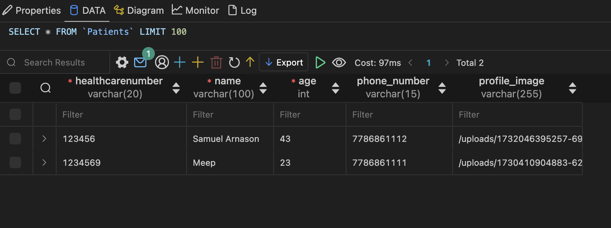

## Milestone 4

### 1. Architecture documentation package.

   Please refer to the ArchitecturePackage.md file.

 

### 2. Plan and conduct the review of the architecture package

The 6 step process for reviewing the architecture package:

#### Step 1: Establish purpose of review

*Question Set Name:*  Analysts Architectural Review of Mister ED System

*Purpose:* Assess the performance, accuracy, modifiability, security, availability, & usability of Mister ED.
 

#### Step 2: Establish the subject of the review

*Stakeholders and Concerns:* Software Analysts

#### Step 3: Build or adapt appropriate questionsets

*Questions:*

Respondents = Analyst
 
Criticality = questions revealing incompleteness & issues are most critical
 
1. Can you identify any unresolved issues?
Expected answer: Hopefully no, although very open-ended.

2. How does it handle peak load scenarios & traffic spikes?
Expected answers: Disabling less important features.

3. What is in place for optimizing db queries?
Expected answers: Singleton pattern for the DB.

4. How is the data accuracy validated?
Expected answers: 

5. What design patterns are used to support future changes?
Expected answers: Strategy, Decorator.

6. Are there areas that are difficult/risky to modify?
Expected answers: The DB schema.

7. How is authentication handled?
Expected answers: Log-in.

8. How is system health monitored?
Expected answers: Self-testing.

9. What usability goals are prioritized?
Expected answers: ER locations and wait times, the triage survey

10. How are the user interfaces designed for ease of use?
Expected answers: There are different user interfaces for each user to streamline the experience for each unique use case.

11. Are there any known usability pain points?
Expected answers: Ideally no.

#### Step 4: Plan the details of the review
- We will use class time on Nov. 19 and Nov. 22 to conduct this review.
- We will partner with a new group each review session
- We will review the other groups SAD for 15 minutes before joining together and discussing.

#### Step 5: Perform the review

*Nov. 19th Review*
 
We worked with Team 14.
 

1. No major flaws. Possibly security issues
2. When the system is overwhelmed we can see that a few features get disabled, such as the map.
3. We can see a singleton pattern to ensure there only one database connection.
4. They have checks in place such as character validation when creating an account.
5. Incorporating design patterns such as singleton (database), strategy and decorator.
6. As with all projects, the database would be risky to update.
7. Log-in page that verifies their health number, and strict protocols in place.
8. Theres a self-testing tool within the database to ensure everything is set up properly.
9. Triage survey and the wait times are prioritized. Matches the user requirements.
10. In necessary places, different views are provided to different users depending on what the user needs, specifically with the triage survey.
11. Hard to tell at this stage of development, hopefully no.

*Nov. 22nd Review*
 
We worked with Team 4.
 

1. Not particularly 
2. They like that we turn off the map view even though they like it - helps a ton with availability
3. Unsure as they are unfamiliar with how routers work in JS
4. Forms are not accepted when wrong data types are entered, a field is missing input
5. Can have unlimited users and if a new user group is added, the database can be modified 
6. They didn't see any hard-to-modify areas right now but perhaps in the future. One of the concerns is modifying the database structure in production without setting up validation strategies.
7. Makes sense and looks nice
8. They are unsure how we are doing it 
9. They really liked how we had the bar showing our place in the queue
10. The status page should route the user to the notification page or provide a link
11. No, it looks good now

#### Step 6: Analyze and summarize results

 

### 3. Design Diagrams and System Description
To do:
- Update class diagram to include strategy patterns from last milestone  

### 4. System Implementation

 The goals for Milestone 4 was to finish coding the front-end of the remaining pages: Virtual Triage Form, the Log In Notifications, and the Patient's live status in the triage process.  
 
 The Virtual Triage Form just got a UI tune up.

 Log In was created for Patients and Clinicians. Patients are to sign in with their Health Number and the password they create. Clinicians are to sign in with their Employee ID. Authentification must be handled carefully and requires more work than the time that we have for this, thus, it was coded strictly in the frontend for a specific user that already exists in the database (see Figure #). The Log In is required to use the services and other pages cannot be accessed otherwise (see Figure #). 

  
 Figure #: The UI for the Log In page

 
 Figure #: The user in the database

 
 Figure #: Log in is required
 
 The Notifications page was created to include a Patient's previous notifications and present new notifications from the Clinician's Triage.
 
  
  Figure #: Notifications Page

The Current Status page shows the user where they are in the Triage process at that moment (see Figure #) and once the triage is finished, they are told to navigate to the Notifications page to view their results (Figure #).

Figure #: Live Status
 

Figure #: Redirection to Notifications

All pages can be navgated to via the Home Page

Figure #: Home Page

### 5. Contributions

| Name | Contributions | 
| ----------- | ---------------------- |
| Ella |  |
| Andra | allocation table |
| Shyla | C&C View Section (primary presentation, element catalog, context diagram, variability, rationale), Plan and conduct the review of the architecture package Section|
| Val |  | 
| Alex |  |
